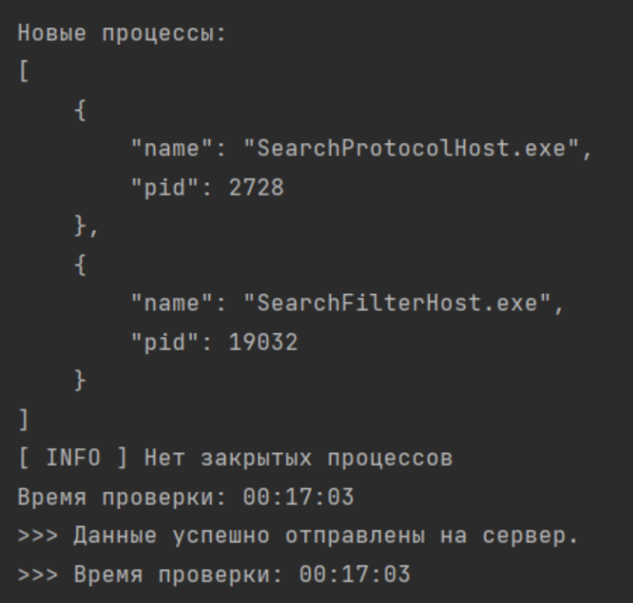
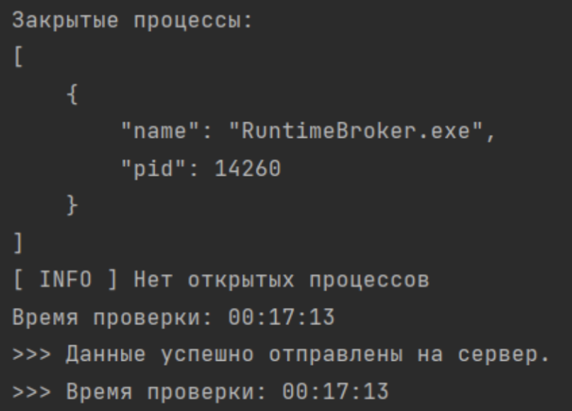
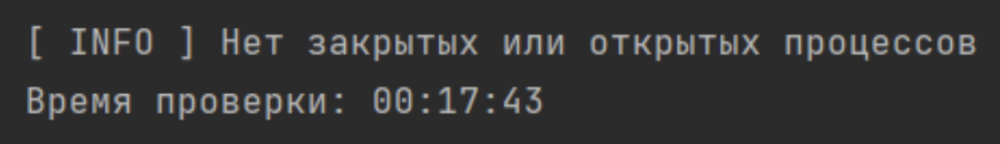
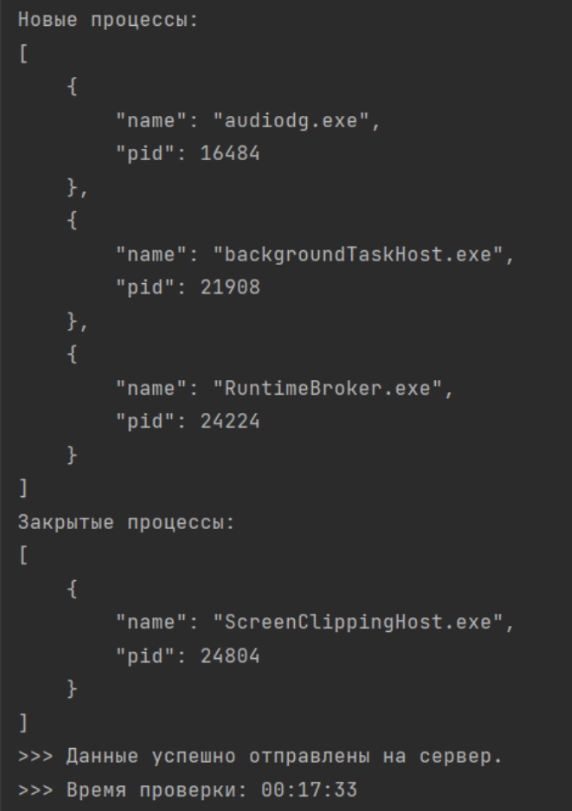

# Концепт EDR-системы

Учебный проект, в рамках которого был создан образ EDR-системы. Так как это не полноценный проект, вся информация выводится в консоль. Процессы отслеживаются в непрерывном режиме до тех пор, пока сам пользователь не прервёт выполнение программы. 

Проект состоит из двух частей - серверная (server.py) и клиентская (main.py) части. Серверная часть запускается с командной строки командой `python server.py` из директории с проектом.

Предполагалось, что данная EDR-система должна быть направлена на мониторинг подозрительных процессов, которые возникают в системе. В рамках учебного проекта было выполнено поверхностное сканирование возникающих новых и закрытых процессов. Возможно усовершенствование функционала для применения его в реальных проектах.

**Пример работы программы:**

1. Вывод только новых процессов

2. Вывод только закрытых процессов

3. Вывод в случае отсутствия процессов

4. Вывод со старыми и новыми процессами одновременно

